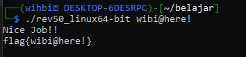

# 🔐 Write-Up: easy_reverse

> **Platform:** crackmes.one  
> **Author:** cbm-hackers  
> **Kategori:** Reverse Engineering  
> **Tingkat Kesulitan:** Easy / Beginner (1.3)  
> **Tools:** Ghidra

---

# 📖 Pendahuluan

Pada write-up ini saya akan menganalisis challenge **easy_reverse** dari **crackmes.one** menggunakan **Ghidra**.

Tujuan challenge ini adalah menemukan input yang benar agar program menampilkan pesan **"Nice Job!!"** beserta flag yang sesuai.

Seluruh analisis dilakukan menggunakan **Static Analysis**, tanpa melakukan brute force maupun patching terhadap binary.

---

# 🔍 1. Identifikasi File

Langkah pertama adalah mengidentifikasi informasi dasar binary menggunakan utilitas `file`.

```bash
file rev50_linux64-bit
```

Output:

```text
rev50_linux64-bit: ELF 64-bit LSB pie executable, x86-64, version 1 (SYSV),
dynamically linked, interpreter /lib64/ld-linux-x86-64.so.2,
for GNU/Linux 3.2.0, BuildID[sha1]=6db637ef1b479f1b821f45dfe2960e37880df4fe,
not stripped
```

## Analisis

Berdasarkan output tersebut diperoleh informasi sebagai berikut.

| Informasi | Nilai |
|-----------|--------|
| Format | ELF |
| Arsitektur | x86-64 (64-bit) |
| Sistem Operasi | GNU/Linux |
| Tipe Binary | PIE Executable |
| Linking | Dynamically Linked |
| Symbol | Not Stripped |

Binary ini merupakan executable Linux 64-bit dengan format **ELF**. Binary juga berstatus **not stripped**, sehingga proses reverse engineering menjadi lebih mudah karena informasi simbol masih tersedia.

> **Screenshot**


---

# 🔍 2. Reconnaissance

Setelah mengetahui format binary, langkah berikutnya adalah membuka executable menggunakan **Ghidra**.

Pada tahap awal dilakukan pencarian string menggunakan fitur **Defined Strings**.

Ditemukan beberapa string yang menarik.

```text
USAGE: %s <password>

try again!

Nice Job!!

flag{%s}
```

Keberadaan string-string tersebut menunjukkan bahwa program menerima sebuah **password** sebagai argument program. Selain itu, apabila password benar, program akan menampilkan pesan **"Nice Job!!"** dan mencetak flag dengan format:

```text
flag{password}
```

Hal ini menjadi petunjuk bahwa proses validasi kemungkinan hanya dilakukan terhadap satu buah input.

> **Screenshot**


---

# 🔍 3. Menelusuri Cross References (XREF)

Langkah berikutnya adalah memilih string yang paling menarik, yaitu:

```text
Nice Job!!
```

dan

```text
flag{%s}
```

Kemudian melihat **Cross References (XREF)** dari kedua string tersebut.

Melalui XREF dapat diketahui fungsi yang bertanggung jawab menampilkan pesan keberhasilan sehingga analisis dapat difokuskan pada fungsi tersebut.

Dengan cara ini tidak perlu membaca seluruh fungsi yang ada di dalam binary.

> **Screenshot**


---

# 🧠 4. Analisis Fungsi

Decompiler Ghidra kemudian digunakan untuk membaca pseudocode dari fungsi yang ditemukan melalui XREF.

Sebelum menganalisis logika program, dilakukan beberapa penyesuaian seperti mengubah **Function Signature** dan melakukan **Rename Variable** agar kode lebih mudah dipahami.

Sebagai contoh:

| Sebelum | Sesudah |
|----------|----------|
| `param_1` | `argc` |
| `param_2` | `argv` |
| `sVar1` | `panjang_str` |

Dengan nama parameter yang lebih deskriptif, alur validasi input menjadi lebih mudah dipahami.

> **Screenshot**


---

# 🚀 5. Solusi

Setelah seluruh proses validasi dianalisis, diperoleh password yang memenuhi seluruh kondisi yang diterapkan oleh program.

Program kemudian akan menampilkan pesan:

```text
Nice Job!!
```

dan mencetak flag menggunakan format:

```text
flag{password}
```

---

# ✅ 6. Verifikasi

Binary kemudian dijalankan menggunakan password yang telah ditemukan.

```bash
./rev50_linux64-bit <password>
```

Apabila password benar, program akan menghasilkan output sebagai berikut.

```text
Nice Job!!

flag{password}
```

Hal ini menunjukkan bahwa proses analisis telah berhasil menemukan input yang benar.

> **Screenshot**



---

# 🎯 Hasil

| Item | Nilai |
|------|-------|
| Challenge | easy_reverse |
| Author | cbm-hackers |
| Platform | crackmes.one |
| Metode | Static Analysis |
| Tools | Ghidra |
| Binary | ELF 64-bit |
| Status | ✅ Solved |

---

# 💡 Hal yang Dipelajari

Melalui challenge ini saya mempelajari beberapa konsep dasar Reverse Engineering, antara lain:

- Mengidentifikasi format executable menggunakan utilitas `file`.
- Memahami karakteristik binary ELF pada sistem Linux.
- Melakukan reconnaissance melalui fitur **Defined Strings**.
- Menggunakan **Cross References (XREF)** untuk menemukan fungsi penting.
- Membaca pseudocode hasil dekompilasi menggunakan Ghidra.
- Melakukan **Function Signature Editing** dan **Rename Variable** agar hasil decompile lebih mudah dipahami.
- Menganalisis proses validasi password melalui static analysis.

---

# 📝 Kesimpulan

Challenge **easy_reverse** merupakan latihan reverse engineering tingkat dasar yang berfokus pada analisis statis terhadap binary Linux.

Dengan memanfaatkan utilitas `file`, fitur **Defined Strings**, **Cross References**, serta **Decompiler** pada Ghidra, logika program dapat dipahami tanpa perlu melakukan debugging ataupun brute force.

Challenge ini memberikan pemahaman mengenai alur analisis binary, mulai dari identifikasi file hingga memahami mekanisme validasi password yang digunakan oleh program.
